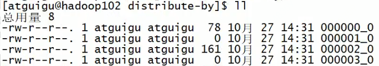
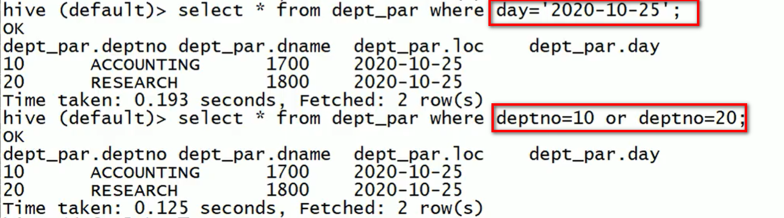
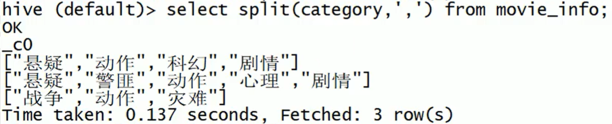

[toc]

### 基本概念

- facebook开源的**海量结构化日志**的数据统计，是基于Hadoop的一个**数据仓库工具**，可以将**结构化的数据映射为一张表**，并提供**类SQL**查询功能。**本质：将HQL转化为MapReduce程序**。

  

  1. hive处理的数据存储在hdfs上
  2. hive分析数据底层的实现是MapReduce
  3. 执行程序运行在Yarn上

- 优缺点

  - 优点
    1. 操作类似SQL，简单、易上手
    2. 避免写MapReduce，节约成本
    3. 执行延迟较高，适用于实时性要求不高的场合
    4. 优势在于处理大批量数据，处理小数据没有优势，因为执行延迟较高
    5. 支持自定义函数
  - 缺点
    1. HQL表达能力有限，迭代式算法无法表达
    2. 数据挖掘方面不擅长
    3. 效率低，自动生成的MapReduce作业通常情况下不够智能化
    4. 调优较困难，粒度粗

- 架构

  

  - CLI：用户接口
  - 元数据(Meta store)：包括表名、表所属的数据库(默认是default)、表的拥有者、列/分区字段、表的类型(是否外部表)、表的数据所在目录等：**默认存储在自带的derby数据库中，推荐使用MySQL存储Metastore**。
  - 驱动器
    - 解析器：将 SQL 字符串转换成抽象语法树 AST，这一步一般都用第 三方工具库完成，比如 antlr；对 AST 进行语法分析，比如表是否存在、字段是否存在、SQL 语义是否有误。
    - 编译器：将 AST 编译生成逻辑执行计划。
    - 优化器：对逻辑执行计划进行优化。 
    - 执行器：把逻辑执行计划转换成可以运行的物理计划。对于 Hive 来 说，就是 MR/Spark。

  

### 数据类型

- 基本数据类型

  | hive数据类型 | java数据类型 |
  | ------------ | ------------ |
  | TINYINT      | byte         |
  | SMALLINT     | short        |
  | INT          | int          |
  | BIGINT       | long         |
  | BOOLEAN      | boolean      |
  | FLOAT        | float        |
  | DOUBLE       | double       |
  | STRING       | String       |
  | TIMESTAMP    |              |
  | BINARY       |              |

- 集合数据类型

  | 数据类型 | 描述                                                         |
  | -------- | ------------------------------------------------------------ |
  | STRUCT   | 和C语言中的 struct 类似，都可以通过“点”符号访问元素内容。例如，如果某个列的数据类型是 `struct { first STRING, last STRING}` , 那么 第 1 个元素可以通过 `字段 .first`  来引用 。 |
  | MAP      | MAP是一组键值对元组集合，使用数组表示法可以访问数据。例如，如果某个列的数据类型是 MAP ，其中键值对是`first John`和`last Doe`，那么 可以通过`字段名['last']`获取最后一个元素 |
  | ARRAY    | 数组是一组具有相同类型和名称的变量的集合。这些变量称为数组的元素，每个数组元素都有一个编号，编号从零开始。例如，数组值为`['John','Doe']`，那么 第 2 个元素可以通过`数组名[1]` 进行引用 。 |

- 实操

  - 有如下json格式数据

    ```json
    {
        "name":"zhangsan",
        // Array类型
        "friends":[
            "lisi",
            "wangwu"
        ],
        // map类型
        "children":{
            "xiao song":18,
            "xiaoxiao song":19
        },
        // struct类型
        "address":{
            "street":"hui long gruan",
            "city":"beijing"
        }
    }
    ```

  - 基于上述数据结构，在hive里创建对应的表，并导入数据

  - 创建本地测试文件`test.txt`

    map、struct、array里的元素间的关系都可以用同一个字符来表示，这里用"_"

    ```
    zhangsan,lisi_wangwu,xiao song:18_xiaoxiao song:19,hai ding_beijing
    yangyang,caicai_susu,xiao yang:18_xiaoxiao yang:19,chao yang_beijing
    ```

  - 在hive上创建测试表test

    ```SPARQL
    create table test(
        -- string
    	name string,
        -- array
    	friends array<string>,
        -- map
        children map<string, int>,
        -- struct
    	address struct<street:string, city:string
    )
    -- 列分隔符
    row format delimited fields terminated by ','
    -- map、struct、array分隔符
    collection items terminated by '_'
    -- map的key、value分隔符
    map keys terminated by ':'
    -- 行分隔符
    lines terminated by '\n';
    ```

  - 导入test.txt到测试表

    - `load data local inpath '/opt/module/hive/test.txt' into table test;`
    - `local`代表从本地导入，否则从HDFS加载数据到hive表

  - 查询
    - `select * from test;`  查所有
    - `select friends[0] from test;`  查array
    - `select children["xiao song"] from test;`   查map
    - `select address.street from test;`  查struct

- 类型转换

  - Hive的原生数据类型是可以进行隐式转换的，类似于 Java 的类型转换，例如某表达式使用 INT 类型， TINYINT 会自动转换为 INT 类型，但是 Hive 不会进行反向转化，例如，某表达式使用 TINYINT 类型， INT 不会自动转换为 TINYINT 类型，它会返回错误，除非使用 cast操作。
  - 隐式类型转换规则如下
    - 任何整数类型都可以隐式地转换为一个范围更广的类型，如TINYINT可以转换成INT，INT可以转换成BIGINT。
    - 所有整数类型、FLOAT和STRING类型都可以隐式地转换成DOUBLE。
    - TINYINT、SMALLINT、INT都可以转换为FLOAT。
    - BOOLEAN类型不可以转换为任何其它的类型。
  - 可以使用CAST操作显式进行数据类型转换
    - 例如`CAST('1' AS INT)`将把字符串`'1'`转换成整数`1`；如果强制类型转换失败，如执行`CAST('X' AS INT)`，表达式返回空值` NULL`。

### DDL数据定义

#### 库

- 创建库，`[]`为可选参数

  ```SPARQL
  CREATE DATABASE [IF NOT EXISTS] database_name
  	[COMMENT database_comment]
  	[LOCATION hdfs_path]
  	[WITH DBPROPERTIES (property_name=property_value,...)];
  ```

  - 创建一个数据库，数据库在HDFS上的默认存储路径是`/user/hive/warehouse/xxx.db`。
  - 通过hadoop在`/user/hive/warehouse`下创建一个目录test，然后放入student.txt文件，再在hive中创建表stu（不用指定location，因为默认就在`/user/hive/warehouse`下），只要文件数据格式（行分隔符，字段类型等等）符合stu表，直接通过`select * from test`就能查出student.txt中的数据。

- 查库
  - `show databases;`
  - `show databases like 'hive*';`   查看以hive开头的库
  - `desc database db_hive;`或 `desc database extended db_hive;`  显示db_hive这个库的详细信息

- 修改库 

  `alter database db_hive set dbproperties('createtime'='20170830');`  为db_hive这个库设置键-值对属性

- 删除库

  - 删除空库：`drop database db_hive;`或`drop database if exists db_hive;`
  - 删除非空库（使用`cascade`强制删除）：`drop database db_hive cascade;`

#### 表

- 创建表，`[]`为可选参数

  ```sql
  CREATE [EXTERNAL] TABLE [IF NOT EXISTS] table_name
  	[(col_name data_type [COMMENT col_comment], ...)]
  	[COMMENT table_comment]
  	[PARTITIONED BY (col_name data_type [COMMENT col_comment], ...)]
  	[CLUSTERED BY (col_name, col_name, ...)
  	[SORTED BY (col_name [ASC|DESC], ...)] INTO num_buckets BUCKETS]
  	[ROW FORMAT row_format]
  	[STORED AS file_format]
  	[LOCATION hdfs_path]
  	[TBLPROPERTIES (property_name=property_value, ...)]
  	[AS select_statement]
   
   -- [EXTERNAL]：创建外部表，否则默认为管理表(内部表)
   -- PARTITIONED BY：分区表
   -- CLUSTERED BY 分桶表
   -- SORTED ... BUCKETS：分桶表
   -- ROW FORMAT row_format：定义行的格式
   -- STORED AS file_format：指定文件格式，sequencefile--二进制序列文件，rcfile--列式存储文件
   -- LOCATION hdfs_path：指定表的位置信息
   -- TBLPROPERTIES：额外属性
   -- AS select_statement：根据查询语句(select_statement)的查询结果创建表
   -- LIKE table_name：复制现有的表结构，但不复制数据
  ```

  - 管理表/外部表

    - 默认创建的表都是管理表（MANAGED_TABLE），也称为内部表。删除表时，管理表的元数据和数据会被一起删除，而外部表只删除元数据，不删除数据。
    - 管理表不适合与其他工具共享数据。生产上用的更多的是外部表

    - 查询表的类型：`desc formatted student`

    - 修改内部表`student`为外部表：

      `alter table student set tblproperties('EXTERNAL'='TRUE');`

    - `('EXTERNAL'='TRUE')`和 `('EXTERNAL'='FALSE')`为固定写法，区分大小写

  - 定义行格式

    ```SPARQL
    create table test (id int, name string)
    	row format delimited fields terminated by ',';
    ```

    - 创建test表，用id、name两列，列数据之间用逗号分隔，另有stu.txt文件

    ```
    1000,zhangsan
    1001,lisi
    ```

    - 用`hadoop fs -put stu.txt  /user/hive/warehouse/test`即可把stu.txt文件放到test表中。

      `select * from test;`即可查出stu.txt中的数据。如果另有stu1.txt文件

    ```
    1003	dawei
    ```

    - 把stu2.txt放到test表中，再查，会查出来两列数据都是NULL，因为stu1.txt内容按逗号分隔第一列数据为"1003    dawei"，不是int类型(test表的id是int类型),第二列数据是null。

- 修改表

  - 修改表名：`ALTER TABLE table_name RENAME TO new_table_name`

  - 更新列

    ```SPARQL
    ALTER TABLE table_name CHANGE [COLUMN] col_old_name col_new_name
    column_type [COMMENT col_comment] [FIRST|AFTER column_name]
    ```

    - 如果某列是string类型，将这一列更新为int类型就会报错，因为更新后数据就都为NULL了
    - 如果只改列名，也需要带上列的类型，否则不能执行

    ```SPARQL
    ALTER TABLE table_name ADD|REPLACE COLUMNS (col_name data_type [COMMENT
    col_comment], ...)
    ```

    - ADD是新增字段，新增字段位置在所有列后面
    - REPLACE是替换表中所有字段：执行`alter table test replace columns(id string);`，则test表中只剩id这一列了（REPLACE可以完成增删改列功能）
    - 假设有个test表，两列分别为id string,name string，有stu.txt数据

    ```
    0001 zhangsan
    0002 lisi
    ```

    - 用`hadoop fs -put stu.txt  /user/hive/warehouse/test`将stu.txt放到test表中，直接查可以查到id，name两列数据。执行`alter table test replace columns(id string);`后，再查只能查到id一列数据，再执行`alter table test replace columns(id string, name string);`后再查，又能查到两列数据。

- 删除表

  `drop table test;`

- 查表

  `show tables;`

### DML数据操作

- 向表中装载数据

  ```SPARQL
  hive> load data [local] inpath '数据的path' [overwrite] into table
  student [partition (partcol1=val1, ...)];
  ```

  - `load data`：加载数据
  - `local`：表示从本地加载数据到hive表，否则从HDFS加载数据到hive表。如果是本地，则是复制，如果是HDFS，则是剪切
  - `inpath`：表示加载数据的路径
  - `overwrite`：表示覆盖表中已有数据
  - `into table`：表示加载到哪张表
  - `student`：表名

- load/put/insert增加数据的区别

  - 对于新建的表，meastore中`TABLE_PARAMS`表的`numFiles`和`numRows`都是0
  - insert：会走MapReduce，`numFiles`和`numRows`值都会更新，执行`select count(*)`直接取`numRows`的值。
  - put：通过put，hive能读到数据是因为地址指向了这个目录，但不会改变任何元数据信息，`numFiles`和`numRows`值都不会更新。执行`select count(*)`也不会触发MapReduce，就像数据丢了一样，小于真正的数据量。
  - load：执行load命令会修改元数据信息，`numFiles`会更新，但`numRows`值不会更新，执行`select count(*)`就会走MapReduce。

- 向表中插入数据

  ```SPARQL
  # 创建表
  hive (default)> create table student_par (id int, name string) row format
      delimited fields terminated by '\t';
  
  # 基本插入数据
  hive (default)> insert into table student_par values (1,'wangwu'),(2,'lisi');
  
  # 基本模式插入(根据单张表查询结果)
  # insert into：以追加的方式插入到表或分区
  # insert overwrite：会覆盖表中已存在的数据
  hive (default)> insert overwrite table student _par
      select id, name from student where month='201709';
  
  # 多表(多分区)插入模式
  # 从student表中，查询符合指定month的id,name插到表student的指定分区中，
  hive (default)> from student
      insert overwrite table student partition(month='201707')
      select id, name where month='201709'
      insert overwrite table student partition(month='201706')
      select id, name where month='201709';
  
  # 从student表中，查询id,name插到表student1中，查询id,name插到表student2中
  hive (default)> from student
      insert into table student1
      select id, name
      insert into table student2
      select id, name;
  
  # 创建student1表，表中的字段和数据来自student
  create table if not exists student1
      as select id, name from student;
  ```

- 创建表时通过Location指定加载数据路径

  ```SPARQL
  # hadoop在根目录下创建student5目录
  hadoop fs -mkdir /student5
  
  # 在student5目录中放入student.txt文件
  hadoop fs -put student.txt /student5
  
  # 创建student5这个外部表，默认路径在/user/hive/warehouse/student5，此时执行select *是没有
  # 数据的，因为与student.txt不在同一目录下
  hive (default)> create external table if not exists student5(
      id int, name string
      row format delimited fields terminated by '\t';
      
  # 通过location指定位置后select才能查出来数据
  # 如果这里不用外部表，而用管理表，一旦删表，student.txt这个文件就没了
  hive (default)> create external table if not exists student5(
      id int, name string
      row format delimited fields terminated by ' t'
      location '/student5'
  ```

- 导出数据

  - Insert导出

    ```SPARQL
    # local表示本地，否则是指HDFS路径
    hive (default)> insert overwrite local directory
        '/opt/hive/data/export/student'
        select * from student;
    
    # 导出到本地，并且指定分隔符
    hive(default)>insert overwrite local directory
        '/opt/hive/data/export/student1'
        ROW FORMAT DELIMITED FIELDS TERMINATED BY '\t'
        select * from student;
    
    # 数据导出到HDFS，导出的这个目录可以自动创建
    hive (default)> insert overwrite directory '/user/atguigu/student2'
      ROW FORMAT DELIMITED FIELDS TERMINATED BY '\t'
      select * from student;
    ```

  - Hadoop导出到本地

    ```SPARQL
    # 没有Local
    hive (default)> dfs get /user/hive/warehouse/student/student.txt
        /opt/module/data/export/student3;
    ```

  - Hive shell导出

    ```shell
    # 语法：hive -f/-e 执行语句或者脚本 > file，终端中执行，不是hive中执行，非默认库时，需要加库名
    [atguigu@hadoop102 hive]$ bin/hive -e 'select * from default.student;' >
    /opt/module/hive/data/export/student4.txt;
    ```

  - export导出到HDFS上

    ```SPARQL
    # 将student导出到根目录下的student1目录后，/student1下会有_metadata文件和student中的文件
    hive (default)> export table default.student to '/student1';
    
    # import命令导入的路径("/student1")必须是export导出的路径
    # 如果student表不存在，'/student1'中的数据会导到student表中
    # 如果student表存在，但数据为空，'/student1'中的数据也会导到student表中(前提是格式符合)
    # 如果student表存在，且表中有数据，import就会失败
    hive (default)> import table student form '/student1';
    ```

    - export和 import主要用于 两个 Hadoop平台集群之间 Hive表迁移

- 清空表数据

  - `hive (default)> truncate table student;`，只删除管理表中的数据，不能删除外部表中的数据；不能删除元数据，只删除表中的数据，表结构还在。
  - `hive> drop table if exists iot_devicelocation;`，删除表，包含元数据

### 查询

- [文档](https://cwiki.apache.org/confluence/display/Hive/LanguageManual+Select)

- 语法

  ```SPARQL
  SELECT [ALL|DISTINCT] select_expr, select_expr, ...
      FROM table_reference
      [WHERE where_condition]
      [GROUP BY col_list]
  	[HAVING col_list]
      [ORDER BY col_list]
      [CLUSTER BY col_list
          | [DISTRIBUTE BY col_list] [SORT BY col_list]
      ]
      [LIMIT number]
  ```

#### 基本查询

- 数据准备

  - dept.txt

    ```
    10 ACCOUNTING 1700
    20 RESEARCH 1800
    30 SALES 1900
    40 OPERATIONS 1700
    ```

  - emp.txt（有的数据为空）

    ```
    7499    ALLEN    SALESMAN    7698    1981-2-20    1600.00    300.00    30
    7521    WARD    SALESMAN    7698    1981-2-22    1250.00    500.00    30
    7566    JONES    MANAGER    7839    1981-4-2    2975.00    20
    7654    MARTIN    SALESMAN    7698    1981-9-28    1250.00    1400.00    30
    7698    BLAKE    MANAGER    7839    1981-5-1    2850.00    30
    7782    CLARK    MANAGER    7839    1981-6-9    2450.00    10
    7788    SCOTT    ANALYST    7566    1987-4-19    3000.00    20
    7839    KING    PRESIDENT    1981-11-17    5000.00    10
    7844    TURNER    SALESMAN    7698    1981-9-8    1500.00    0.00    30
    7876    ADAMS    CLERK    7788    1987-5-23    1100.00    20
    7900    JAMES    CLERK    7698    1981-12-3    950.00    30
    7902    FORD    ANALYST    7566    1981-12-3    3000.00    20
    7934    MILLER    CLERK    7782    1982-1-23    1300.00    10
    ```
  
- 创建部门表
  
  ```SPARQL
    create table if not exists dept(
        deptno int,
        dname string,
        loc int
    )
    row format delimited fields terminated by '\t';
  ```
  
- 创建员工表
  
  ```SPARQL
    create table if not exists emp(
        empno int,
        ename string "部门名称",
        job string,
        mgr int comment "领导",
        hiredate string "入职时间",
        sal double comment "薪水",
        comm double comment "奖金",
        deptno int comment "部门编号")
        row format delimited fields terminated by '\t';
  ```
  
- `hive (default)> load data local inpath '/opt/datas/dept.txt' into table dept;`
    `hive (default)> load data local inpath '/opt/datas/emp.txt' into table emp;`
  
- 全表查询/特定列查询

  `hive (default)> select * from emp;`
  `hive (default)> select empno,ename,job,mgr from emp ;`

- 别名

  `hive (default)> select ename AS name, deptno dn from emp;`

- 常用函数

  1. 求总行数（count）

     `hive (default)> select count(*) cnt from emp;`

  2. 求工资的最大值（max）
     `hive (default)> select max(sal) max_sal from emp;`

  3. 求工资的最小值（min）
     `hive (default)> select min(sal) min_sal from emp;`

  4. 求工资的总和（sum）
     `hive (default)> select sum(sal) sum_sal from emp;`

  5. 求工资的平均值（avg）
     `hive (default)> select avg(sal) avg_sal from emp;`

- limit语句

  `hive (default)> select * from emp limit 5;`

- where语句

  `hive (default)> select * from emp where sal >1000;`

- 比较运算符

  | 运算符                  | 类型             | 说明                                                         |
  | ----------------------- | ---------------- | :----------------------------------------------------------- |
  | A = B                   | 所有原生类型<br> | 如果A与B相等,返回TRUE,否则返回FALSE                          |
  | A == B                  | 无               | 失败，因为无效的语法。 SQL使用”=”，不使用”==”。              |
  | A <> B A!=b             | 所有原生类型     | 如果A不等于B返回TRUE,否则返回FALSE。如果A或B值为”NULL”，结果返回”NULL”。 |
  | A<=>B                   | 所有原生类型     | 如果A 和 B 都为 NULL ，则返回 TRUE 如果一边为 NULL返回 False |
  | A < B                   | 所有原生类型     | 如果A小于B返回TRUE,否则返回FALSE。如果A或B值为”NULL”，结果返回”NULL”。 |
  | A <= B                  | 所有原生类型     | 如果A小于等于B返回TRUE,否则返回FALSE。如果A或B值为”NULL”，结果返回”NULL”。 |
  | A > B                   | 所有原生类型     | 如果A大于B返回TRUE,否则返回FALSE。如果A或B值为”NULL”，结果返回”NULL”。 |
  | A >= B                  | 所有原生类型     | 如果A大于等于B返回TRUE,否则返回FALSE。如果A或B值为”NULL”，结果返回”NULL”。 |
  | A [NOT] BETWEEN B AND C | 所有原生类型     | 如果A B 或者 C 任一为 NULL ，则结果为 NULL 。如果 A 的值大于等于 B 而且小于或等于 C ，则结果为 TRUE ，反之为 FALSE 。如果使用 NOT 关键字则可达到相反的效果。B < C。 |
  | A IS NULL               | 所有类型         | 如果A值为”NULL”，返回TRUE,否则返回FALSE                      |
  | A IS NOT NULL           | 所有类型         | 如果A值不为”NULL”，返回TRUE,否则返回FALSE                    |
  | A LIKE B                | 字符串           | 如果A或B值为”NULL”，结果返回”NULL”。字符串A与B通过sql进行匹配，如果相符返回TRUE，不符返回FALSE。B字符串中 的”_”代表任一字符，”%”则代表多个任意字符。例如： (‘foobar’ like ‘foo’)返回FALSE，（ ‘foobar’ like ‘foo\_ _ _’或者 ‘foobar’ like ‘foo%’)则返回TURE，说明如下：‘ x%’表示 A 必须以字母‘ x ’开头 ，‘%x ’表示 A必须以字母’x ’结尾，而 ‘%x%’表示 A 包含有字母'x' 可以位于开头，结尾或者字符串中间。如果使用 NOT 关键字则可达到相反的效果。 |
  | A RLIKE B，A REGEXP B   | 字符串           | 如果A或B值为”NULL”，结果返回”NULL”。字符串A与B通过java进行匹配，如果相符返回TRUE，不符返回FALSE。例如：（ ‘foobar’ rlike ‘foo’）返回FALSE，（’foobar’ rlike ‘^f.*r$’ ）返回TRUE。 |

- like和rlike

  - "%"代表0个或多个字符
  - "_"表示一个字符
  - rlike表示利用正则来匹配

  1. 查找 名字中第二个字母为 A 的员工信息
     `hive (default)> select * from emp where ename LIKE '_A%'`
  2. 查找 名字中带有 A 的员工信息
     `hive (default)> select * from emp where ename RLIKE '[A]'`

#### 分组

- Group By

  - 计算emp表每个部门的平均工资

    `hive (default)> select t.deptno, avg(t.sal) avg_sal from emp t group by
    t.deptno;`

  - 计算 emp 每个部门中每个岗位的最高薪水
    `hive (default)> select t.deptno, t.job, max(t.sal) max_sal from emp t
    group by t.deptno, t.job;`

- Having

  - where后面不能写分组函数 而 having后面可以使用分组函数。
  - having只用于 group by分组统计语句。
  - 求每个部门的平均薪水大于 2000 的部门
    - 求每个部门的平均工资
      `hive (default)> select deptno, avg(sal) from emp group by deptno;`
    - 求每个部门的平均薪水大于2000 的部门
      `hive (default)> select deptno, avg(sal) avg_sal from emp group by deptno
      having avg_sal > 2000;`

#### join

​		

- 内连接

  只有进行连接的两个表中都存在与连接条件相匹配的数据才会被保留下来。
  `hive (default)> select e.empno, e.ename, d.deptno from emp e inner join dept d`

  `on e.deptno = d.deptno;`

- 左外连接

  JOIN 操作符左边表中符合 WHERE 子句的所有记录将会被返回。
  `hive (default)> select e.empno, e.ename, d.deptno from emp e left join dept d `

  `on e.deptno = d.deptno;`

- 右外连接

  JOIN 操作符右边表中符合 WHERE 子句的所有记录将会被返回。
  `hive (default)> select e.empno, e.ename, d.deptno from emp e right join dept d `

  `on e.deptno = d.deptno;`

- 满外连接/全外连接

  将会返回所有表中符合WHERE 语句条件的所有记录。如果任一表的指定字段没有符合条件的值的话，那么就使用 NULL 值替代。
  `hive (default)> select e.empno, e.ename, d.deptno from emp e full join dept d `

  `on e.deptno = d.deptno;`

  或

  `hive (default)> select e.empno, e.ename, d.deptno from emp e left join dept d `

  `on e.deptno = d.deptno`

  `union`

  `select e.empno, e.ename, d.deptno from emp e right join dept d `

  `on e.deptno = d.deptno;`

- 左连接

  `hive (default)> select e.empno, e.ename, d.deptno from emp e left join dept d `

  `on e.deptno = d.deptno `

  `where d.deptno is null;`

- 右连接

  `hive (default)> select e.empno, e.ename, d.deptno from emp e right join dept d `

  `on e.deptno = d.deptno `

  `where e.deptno is null;`

- 两表独有数据集

  `hive (default)> select e.empno, e.ename, d.deptno from emp e full outer join dept d `

  `on e.deptno = d.deptno `

  `where e.deptno is null or d.deptno is null;`

  或

  `hive (default)> select e.empno, e.ename, d.deptno from emp e left join dept d `

  `on e.deptno = d.deptno `

  `where d.deptno is null`

  `union`

  `select e.empno, e.ename, d.deptno from emp e right join dept d `

  `on e.deptno = d.deptno `

  `where e.deptno is null;`

- union：去重，union all：不去重

- 多表连接
  - 数据准备

  ```
  1700 Beijing
  1800 London
  1900 Tokyo
  ```

  - 创建位置表

  ```SPARQL
  create table if not exists location(
      loc int,
      loc_name string
  )
  row format delimited fields terminated by '\t';
  ```

  - 导入数据

  ```SPARQL
  hive (default)> load data local inpath '/opt/module/datas/location.txt'
  into table location;
  ```

  - 多表查询

  ```SPARQL
  hive (default)> SELECT e.ename, d.dname, l.loc_name
      FROM emp e
      JOIN dept d
      ON d.deptno = e.deptno
      JOIN location l
      ON d.loc = l.loc;
  ```

- 笛卡尔积

  - 笛卡尔集会在下面条件下产生
    1. 省略连接条件
    2. 连接条件无效
    3. 所有表中的所有行互相连接
  - `hive (default)> select empno, dname from emp, dept;`

#### 排序

- 全局排序（Order By），无论设置reduce为几个，只有一个，效率相对较低。默认ASC升序。

- 按照别名排序

  - `hive (default)> select ename, sal*2 twosal from emp order by twosal;`

- 多个列排序

  - `hive (default)> select ename, deptno, sal from emp order by deptno, sal;`

- 每个Reduce内部排序（Sort By）

  - 对于大规模的数据集，order by的效率非常低。在很多情况下，并不需要全局排序，此时可用sort by，Sort by为每个 reducer产生一个排序文件。 每个 Reducer内部进行排序 对全局结果集来说不是排序。

  - 设置reduce个数：`hive (default)> set mapreduce.job.reduces=3;`

  - 查看reduce个数：`hive (default)> set mapreduce.job.reduces;`

  - 根据部门编号，降序查看员工信息

    `hive (default)> select ename, deptno from emp sort by deptno desc;`

    按部门编号，分成三个区(因为reduce被设为3)，每个区内降序，但这种并不知道是按什么进行分区的，只知道被分成了三个区：

    

  - 将结果导入文件中（按部门编号降序查看员工信息）

    ```SPARQL
    hive (default)> insert overwrite local directory
        '/opt/module/data/sort-by'
        select ename, deptno from emp sort by deptno desc;`
    ```

    生成了三个文件：

    

    每个文件内容：

    

- 分区（Distribute By）

  - 在有些情况下,我们需要控制某个特定行应该到哪个reducer 通常是为了进行后续的聚集操作。distribute 

    by 子句可以做这件事。distribute by类似MR中partition，进行分区，结合sort by使用。

  - 对distribute by 进行测试，一定要分配多reduce进行处理，否则无法看到 distribute by效果。

  - distribute by 的分区规则是根据分区字段的hash码与reduce的个数进行模除后，余数相同的分到一个区

  - Hive 要求 DISTRIBUTE BY 语句要写在 SORT BY 语句之前。

  - 按照部门编号、薪水查看员工信息

    `hive (default) select deptno,ename,sal from emp order by deptno,sal;`

    结果：

    

    ```SPARQL
    hive (default)> set mapreduce.job.reduces=4;
    hive (default)> select deptno,ename,sal from emp distribute by deptno sort by sal;
    ```

    结果（将deptno % 4，只有两个结果，所以只有两个区）：

    

     ```SPARQL
    hive (default)> set mapreduce.job.reduces=4;
    # 按deptno分区，区内按sal排序
    hive (default)> insert overwrite local directory 
        '/opt/module/data/distribute-by'
        select deptno,ename,sal from emp distribute by deptno sort by sal;
     ```

    分成四个区，（将deptno % 4，只有两个结果，所以只有两个区有数据，另外两个区是空的）：

    

    分区内容：

    

    ```SPARQL
    hive (default)> set mapreduce.job.reduces=4;
    # 按deptno分区，区内按deptno排序
    hive (default)> insert overwrite local directory 
        '/opt/module/data/distribute-by'
        select deptno,ename,sal from emp distribute by deptno sort by deptno;
    ```

    结果：

    

- Cluster By

  - 当distribute by 和 sorts by字段相同时，可以使用cluster by方式。

  - cluster by除了具有distribute by的功能外还兼具sort by的功能。但是排序只能是升序排序，不能指定排序规则为ASC或者DESC。

  - 以下两种写法等价

    ```SPARQL
    hive (default)> select * from emp cluster by deptno;
    hive (default)> select * from emp distribute by deptno sort by;
    ```

### 分区/分桶

#### 分区

- 分区表实际上就是对应一个HDFS文件系统上的独立的文件夹，该文件夹下是该分区所有的数据文件。**Hive中的分区就是分目录**，把一个大的数据集根据业务需要分割成小的数据集。**在查询时通过WHERE子句中的表达式选择查询所需要的指定的分区，这样的查询效率会提高很多。**（分区前查全表，分区后查分区(全表的一部分)，所以效率提高了）

- 分区基本操作

  - 引入分区表（需要根据日期对日志进行管理, 通过部门信息模拟）

    ```
    dept_20200401.log
    10 ACCOUNTING 1700
    20 RESEARCH 1800
    
    dept_20200402.log
    30 SALES 1900
    40 OPERATIONS 1700
    
    dept_20200403.log
    50 TEST 2000
    60 DEV 1900
    ```

  - 创建分区表语法

    分区字段（这里是day）**不能是表中已经存在的字段**，可以将分区字段看作表的伪列。

    ```SPARQL
    hive (default)> create table dept_par(
        deptno int, dname string, loc string
    )
    partitioned by (day string)
    row format delimited fields terminated by '\t';
    ```

  - 加载数据

    分区表加载数据时，必须指定分区（不指定会生成一个默认的分区）

    ```SPARQL
    hive (default)> load data local inpath
        '/opt/module/hive/datas/dept1.txt' 
        into table dept_par
        partition(day='2020-10-25');
    
    hive (default)> load data local inpath
        '/opt/module/hive/datas/dept2.txt' 
        into table dept_par
        partition(day='2020-10-26');
    
    hive (default)> load data local inpath
        '/opt/module/hive/datas/dept3.txt' 
        into table dept_par
        partition(day='2020-10-27');
    ```

  - 查询数据

    

    对于如下两个查询，结果一样，但第一个查询效率高，因为它指定了分区，而第二个查询会全表扫描。

    

  - metastore里的PARTITIONS表就记录了分区信息

  - 分区字段相当于一个伪列，和其他字段放在不同位置（分区字段是目录，其他的字段放在文件里）

    

  - 单分区查询

    ```SPARQL
    hive (default)> select * from dept_par where day='2020-10-26';
    ```

  - 多分区联合查询

    ```SPARQL
    hive (default)> select * from dept_par where day='2020-10-256'
        union
        select * from dept_par where day='2020-10-26'
        union
        select * from dept_par where day='2020-10-27';
    
    hive (default)> select * from dept_par where day='2020-10-25' 
        or day='2020-10-26' 
        or day='2020-10-27';
    ```

  - 增加分区

    ```SPARQL
    # 增加单个分区
    hive (default)> alter table dept_par add partition(day='2020-10-28');
    
    # 增加多个分区，分区间用空格分隔
    hive (default)> alter table dept_par add partition(day='2020-10-29')
        partition(day='2020-10-30;
    ```

  - 删除分区

    ```SPARQL
    # 删除单个分区
    hive (default)> alter table dept_par drop partition
        (day='2020-10-30');
    
    # 删除多个分区，分区间用逗号分隔
    hive (default)> alter table dept_par drop partition (day='2020-10-39'),
        partition(day='2020-10-28');
    ```

  - 查看分区表有多少个分区

    ```SPARQL
    hive (default)> show partitions dept_par;
    ```

  - 查看分区表结果

    ```SPARQL
    hive> desc formatted dept_par;
    # Partition Information
    # col_name data_type comment
    day string
    ```

- 二级分区

  如何一天的日志数据量也很大，如何再将数据拆分？按小时分...

  - 创建二级分区表

    ```SPARQL
    hive (default)> create table dept_par2(
        deptno int, dname string, loc string
    )
    partitioned by (day string, hour string)
    row format delimited fields terminated by '\t';
    ```

  - 加载数据

    ```SPARQL
    hive (default)> load data local inpath
        '/opt/module/hive/datas/dept1.log' 
        into table dept_par2 
        partition(day='2020-10-27', hour='11');
    ```

    

  - 查询分区数据

    ```SPARQL
    hive (default)> select * from dept_partition2 
        where day='2020-10-27' and hour='12';
    ```

    

  - 分区表关联数据的三种方式

    如上“分区基本操作”示例，先创建分区表，再往表里面加载数据，同时指定分区。那么加载的数据(dept1.txt、dept2.txt、dept3.txt三个文件)就按指定的分区位于不同的分区中。

    如果此时手动在`/user/hive/warehouse/dept_par`中创建一个目录`2020-10-29`，再往`2020-10-29`里放一个文件。那么`2020-10-29`是否能被识别成分区？不能，metastore里根本没记录`2020-10-29`。

    对应命令：

    `hadoop fs -mkdir /user/hive/warehouse/dept_par/day=2020-10-29`

    `hadoop fs -put dept4.txt /user/hive/warehouse/dept_par/day=2020-10-29`

    解法方法：

    1. 执行修复命令：`hive (default)> msck repair table dept_par;`

    2. 添加分区：`hive (default)> alter table dept_par add patition(day='2020-10-29');`

    3. 创建文件夹后直接load，不put

       ```SPARQL
       hive (default)> load data local inpath
           '/opt/module/hive/datas/dept4.txt' 
           into table dept_par 
           partition(day='2020-10-29');
       ```

- 动态分区调整

  关系型数据库中，对分区表insert数据时候，数据库自动会根据分区字段的值，将数据插入到相应的分区中，Hive 中也提供了类似的机制，即动态分区(Dynamic Partition)，只不过，使用Hive的动态分区，需要进行相应的配置。

  - 开启动态分区参数设置

    1. 开启动态分区功能（默认 true，开启）

       `hive (default)> hive.exec.dynamic.partition=true`

    2. 设置为非严格模式（动态分区的模式，默认 strict，表示必须指定至少一个分区为静态分区，nonstrict 模式表示允许所有的分区字段都可以使用动态分区。）

       `hive (default)> hive.exec.dynamic.partition.mode=nonstrict`

    3. 在所有执行MR的节点上，最大一共可以创建多少个动态分区。默认 1000

       `hive (default)> hive.exec.max.dynamic.partitions=1000`

    4. 在每个执行 MR 的节点上，最大可以创建多少个动态分区。该参数需要根据实际的数据来设定。比如：源数据中包含了一年的数据，即 day 字段有 365 个值，那么该参数就需要设置成大于365，如果使用默认值100，则会报错。

       `hive (default)> hive.exec.max.dynamic.partitions.pernode=100`

    5. 整个MR Job中，最大可以创建多少个HDFS文件。默认 100000

       `hive (default)> hive.exec.max.created.files=100000`

    6. 当有空分区生成时，是否抛出异常。一般不需要设置。默认 false

       `hive (default)> hive.error.on.empty.partition=false`

  - 示例

    创建分区表

    ```SPARQL
    hive (default)> create table dept_no_par(dname string, loc string)
        partitioned by (deptno int) 
        row format delimited fields terminated by '\t';
    ```

    导入数据

    ```SPARQL
    # 创建静态分区
    hive (default)> insert into table dept_no_par partition(deptno='70')
        select dname, loc from dept;
    
    # 创建动态分区，以dept的deptno作为分区
    # partition内只写分区名，select...的最后一个字段作为分区信息
    hive (default)> insert into table dept_no_par partition(deptno)
        select dname, loc, deptno from dept;
    
    # 如果不指定"partition(deptno)"，也会用dept表的deptno作为分区信息,hive3新加的功能
    # 再建个dept_no_par2表
    hive (default)> create table dept_no_par2(dname string, loc string)
        partitioned by (deptno int) 
        row format delimited fields terminated by '\t';
    # 不指定"partition(deptno)"
    hive (default)> insert into table dept_no_par2 
        select dname, loc, deptno from dept;
    
    # 即使是在严格模式(strict)下，不指定"partition(deptno)"，也能创建动态分区
    # 再建个dept_no_par3表
    hive (default)> create table dept_no_par3(dname string, loc string)
        partitioned by (deptno int) 
        row format delimited fields terminated by '\t';
    # 不指定"partition(deptno)"，在select最后加上动态分区字段，创建动态分区成功
    hive (default)> insert into table dept_no_par3
        select dname, loc, deptno from dept;
    ```

    如下图，分区信息"deptno=10"、"deptno=10"...来自dept表的deptno列

    

#### 分桶

- 分区提供一个隔离数据和优化查询的便利方式。不过，并非所有的数据集都可形成合理的分区。对于一张表或者分区，Hive 可以进一步组织成桶，也就是更为细粒度的数据范围划分。

- 分桶是将数据集分解成更容易管理的若干部分的另一个技术。 

- **分区针对的是数据的存储路径；分桶针对的是数据文件**。

- 创建分桶表

  - 数据准备 student.txt

    ```
    1001 ss1
    1002 ss2
    1003 ss3
    1004 ss4
    1005 ss5
    1006 ss6
    1007 ss7
    1008 ss8
    1009 ss9
    1010 ss10
    1011 ss11
    1012 ss12
    1013 ss13
    1014 ss14
    1015 ss15
    1016 ss16
    ```

  - 创建分桶表

    **分桶表用clustered by指定一个表中已有的字段作为分桶字段。**

    对分桶字段的值进行哈希，然后除以桶的个数求余的方 式决定该条记录存放在哪个桶当中

    ```SPARQL
    hive (default)> create table stu_buck(id int, name string)
        clustered by(id)
        into 4 buckets
        row format delimited fields terminated by '\t';
    ```

  - 查看表结构

    ```SPARQL
    hive (default)> desc formatted stu_buck;
    Num Buckets: 4 
    Bucket Columns: [id]
    ```

  - 导入数据到分桶表，load的方式

    ```SPARQL
    hive (default)> load data inpath '/student.txt' into table stu_buck;
    ```

    按照id % 4的值，分成了四个桶

    
    

  - 分桶表注意事项

    1. reduce 的个数设置为-1,让 Job 自行决定需要用多少个 reduce 或者将 reduce 的个数设置为大于等于分桶表的桶数
    2. 从 hdfs 中 load 数据到分桶表中，避免本地文件找不到问题
    3. 不要使用本地模式

  - insert方式将数据导入分桶表

    ```SPARQL
    hive(default)>insert into table stu_buck select * from xxx;
    ```

- 抽样查询

  - 对于非常大的数据集，有时用户需要使用的是一个具有代表性的查询结果而不是全部结果。Hive 可以通过对表进行抽样来满足这个需求。

  - 语法: `TABLESAMPLE(BUCKET x OUT OF y)`

    y必须是table总bucket数的倍数或者因子。hive根据y的大小，决定抽样的比例。例如，table总共分了64份，当y=32时，抽取(64/32=)2个bucket的数据，当y=128时，抽取(64/128=)1/2个bucket的数据。

     x表示从哪个bucket开始抽取。例如，table总bucket数为32，tablesample(bucket 3 out of 16)，表示总共抽取（32/16=）2个bucket的数据，分别为第3个bucket和第（3+16=）19个bucket的数据。

  - 查询stu_buck中的数据

    ```SPARQL
    hive (default)> select * from stu_buck 
        tablesample(bucket 1 out of 4 on id);
    
    ```

    注意：x的值必须小于等于y的值，否则

    ```
    FAILED: SemanticException [Error 10061]: Numerator should not be bigger
    than denominator in sample clause for table stu_buck
    ```

    

### 函数

- 查看系统内置函数：`hive> show functions;`

- 显示自带函数的用法：`hive> desc function upper;`

  

- 详细显示自带函数的用法：`hive> desc function extended upper;`

  

- hive中的函数分三种，

  - UDF：一进一出

  - UDAF：多进一出

  - UDTF：一进多出

    多：指输入数据的函数

    

- 如果员工comm为NULL，就用-1代替

  

- CASE、WHEN、THEN、ELSE、END

  - 数据准备 emp_sex.txt

    ```
    悟空    A    男
    大海    A    男
    宋宋    B    男
    凤姐    A    女
    婷姐    B    女
    婷婷    B    女
    ```

  - 建表

    ```SPARQL
    create table emp_sex(
        name string,
        dept_id string,
        sex string)
    row format delimited fields terminated by "\t";
    
    # 加载数据
    load data local inpath 
    '/opt/module/hive/data/emp_sex.txt' 
    into table emp_sex;
    ```

  - 需求

    求出不同部门男女各多少人

    ```
    dept_Id 男 女
    A 2 1
    B 1 2
    ```

    

    ```SPARQL
    select
        dept_id,
        sum(case sex when '男' then 1 else 0 end) male_count,
        sum(case sex when '女' then 1 else 0 end) female_count
    from 
        emp_sex
    group by dept_id;
    
    # if后第一个表达式为true，就去第二个值，否则取第三个值
    select
        dept_id,
        sum(if(sex='男',1,0)) male_count,
        sum(if(sex='女',1,0)) female_count
    from 
        emp_sex
    group by dept_id;
    ```

- 行转列

  相关函数：

  - `CONCAT(string A/col, string B/col…)`
    - 返回输入字符串连接后的结果，支持任意个输入字符串;

      

  - `CONCAT_WS(separator, str1, str2,...)`

    - 它是一个特殊形式的 `CONCAT()`。第一个参数剩余参数间的分隔符。分隔符可以是与剩余参数一样的字符串。如果分隔符是 NULL，返回值也将为 NULL。这个函数会跳过分隔符参数后的任何 NULL 和空字符串。分隔符将被加到被连接的字符串之间;

      

      

    -  `CONCAT_WS must be "string or array<string>`

  - `COLLECT_SET(col)`/`COLLECT_LIST(col)`

    - 函数只接受基本数据类型，它的主要作用是将某字段的值进行去重汇总，产生 Array 类型字段。

  - 数据准备 person_info.txt

    ```
    孙悟空	白羊座 A
    大海 射手座 A
    宋宋 白羊座 B
    猪八戒 白羊座 A
    凤姐 射手座 A
    苍老师 白羊座 B
    ```

  - 创建表并导入数据

    ```SPARQL
    create table person_info(
        name string,
        constellation string,
        blood_type string)
    row format delimited fields terminated by "\t";
    
    # 导入数据
    load data local inpath 
    "/opt/module/hive/data/person_info.txt" 
    into table person_info;
    ```

  - 需求：把星座和血型一样的人归类到一起。

    ```
    射手座,A    大海|凤姐
    白羊座,A    孙悟空|猪八戒
    白羊座,B    宋宋|苍老师
    ```

    

    ```SPARQL
    # 1. 将星座和血型拼接在一起
    select 
        concat(constellation, ',', blood_type) con_blood,
        name
    from person_info; 
    
    # 以上表作为t1表，得到如下结果
    con_blood    name
    白羊座,A    孙悟空
    射手座,A    大海
    白羊座,B    宋宋
    白羊座,A    猪八戒
    射手座,A    凤姐
    白羊座,B    苍老师
    ```

    ```SPARQL
    # 2. 聚合相同星座血型人的姓名
    # (...)-->把t1表拿过来即可满足需求
    select 
        con_blood,
        concat_ws('|', collect_set(name))
    from
        (...)t1
    group by  con_blood
    ```

- 列转行

  函数说明

  - `EXPLODE(col)`

    - 将 hive 一列中复杂的 Array 或者 Map 结构拆分成多行。

      

  - `LATERAL VIEW`

    - 用于和split, explode等UDTF一起使用，它能够将一列数据拆成多行数据，在此基础上可以对拆分后的数据进行聚合。

  - 数据准备 movie.txt

    ```
    《疑犯追踪》    悬疑,动作,科幻,剧情
    《Lie to me》    悬疑,警匪,动作,心理,剧情
    《战狼 2》    战争,动作,灾难
    ```

  - 创建表导入数据

    ```SPARQL
    create table movie_info(
     movie string,
     category string)
    row format delimited fields terminated by "\t";
    
    # 导入数据
    load data local inpath 
    "/opt/module/data/movie.txt" 
    into table movie_info;
    ```

  - 需求：将电影分类中的数组数据展开。

    ```
    《疑犯追踪》 悬疑
    《疑犯追踪》 动作
    《疑犯追踪》 科幻
    《疑犯追踪》 剧情
    《Lie to me》 悬疑
    《Lie to me》 警匪
    《Lie to me》 动作
    《Lie to me》 心理
    《Lie to me》 剧情
    《战狼 2》 战争
    《战狼 2》 动作
    《战狼 2》 灾难
    ```

    

    1. 用split函数分割

       

    2. 用explode将split的结果拆分

       

    3. 结果explode拆分结果加上name列

       报错，因为movie列只有三条记录，而category经过split、explode远超三条记录

       

    4. 通过lateral view完成需求

       ```SPARQL
       SELECT
           movie,
           category_name
       FROM
           movie_info
       lateral VIEW
           explode(split(category,",")) movie_info_tmp AS category_name;
       ```

       